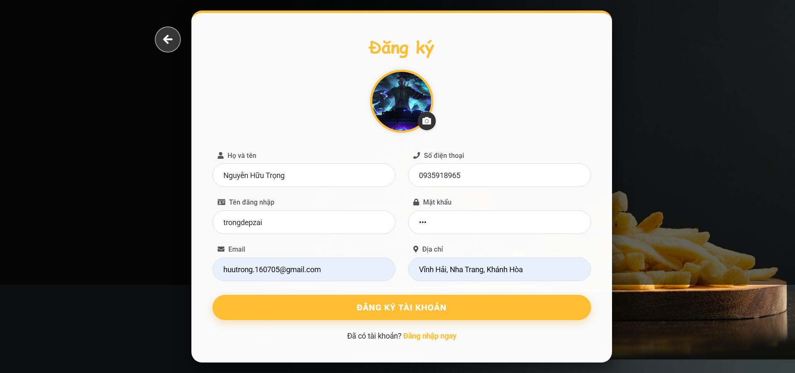
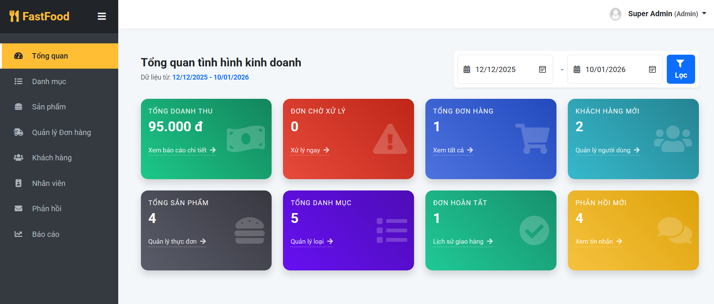
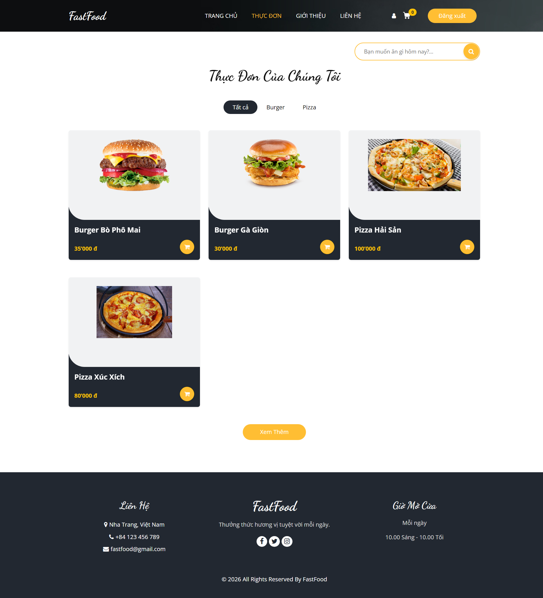
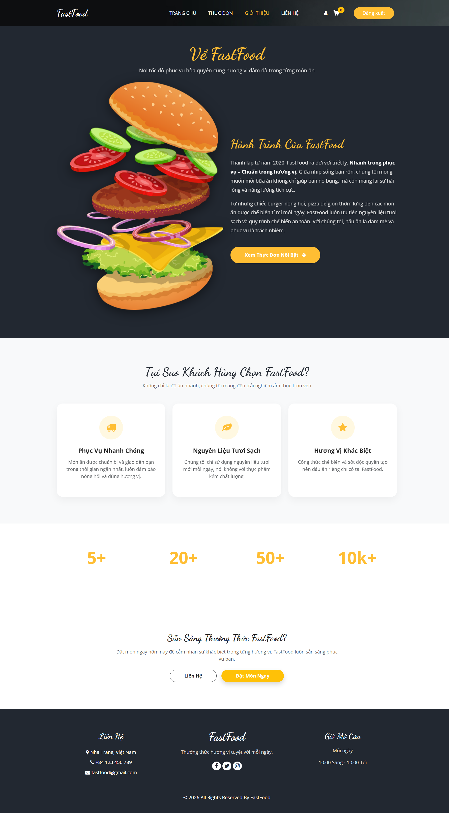
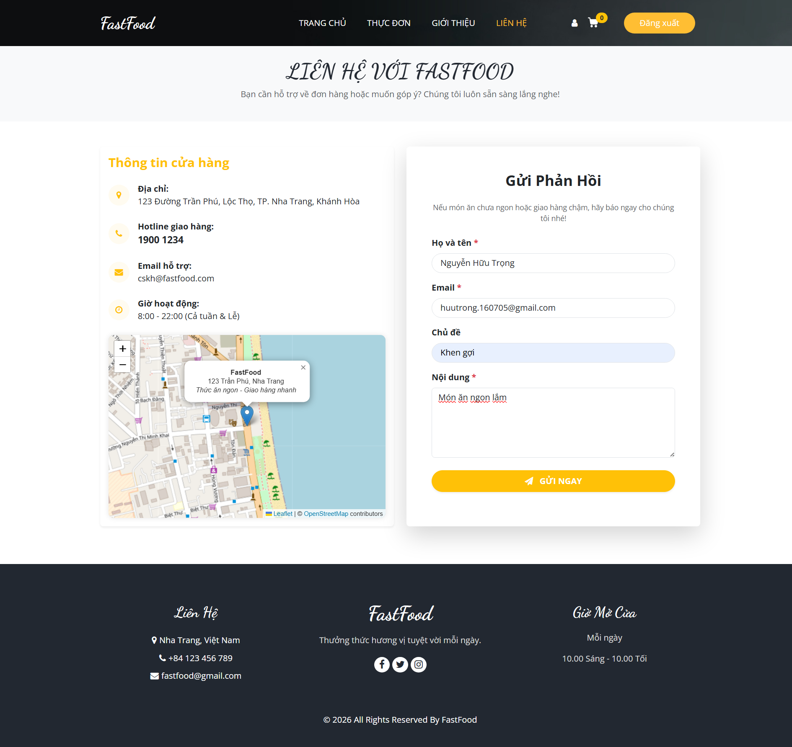
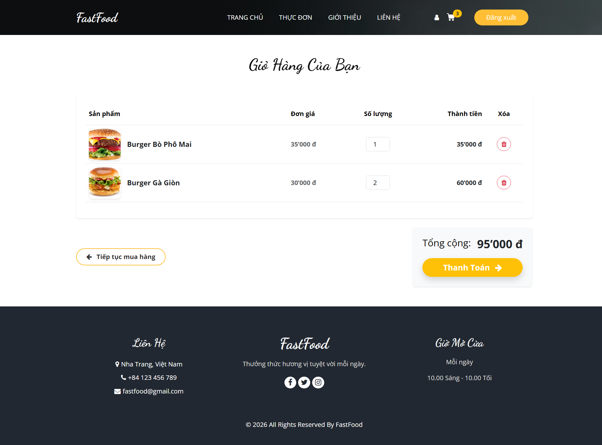
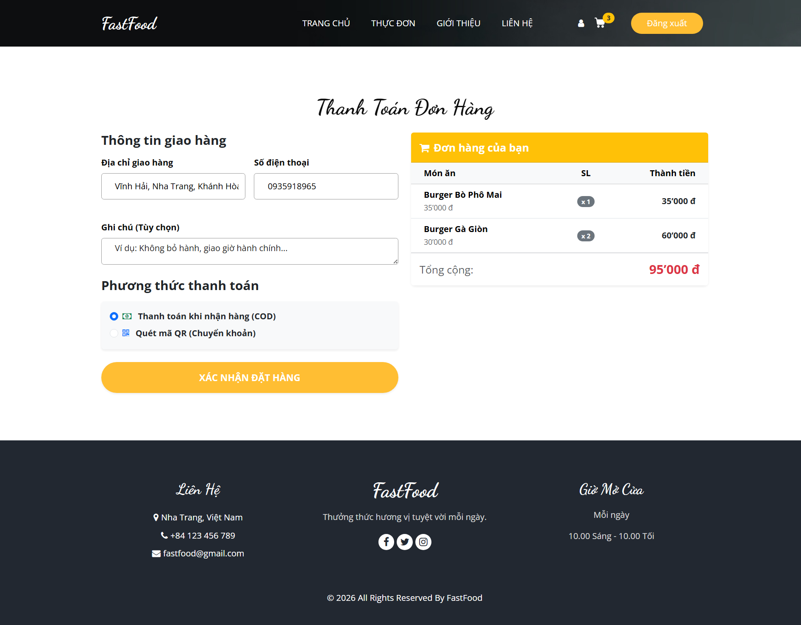
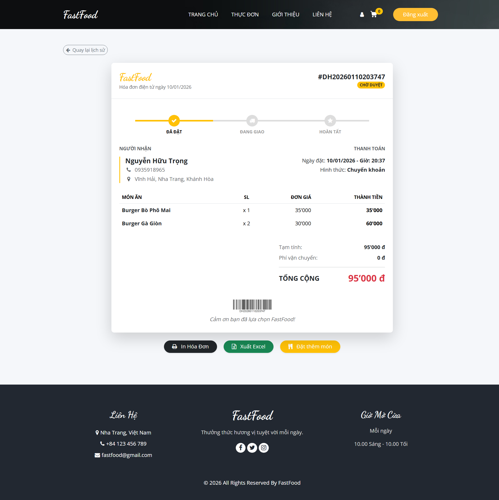
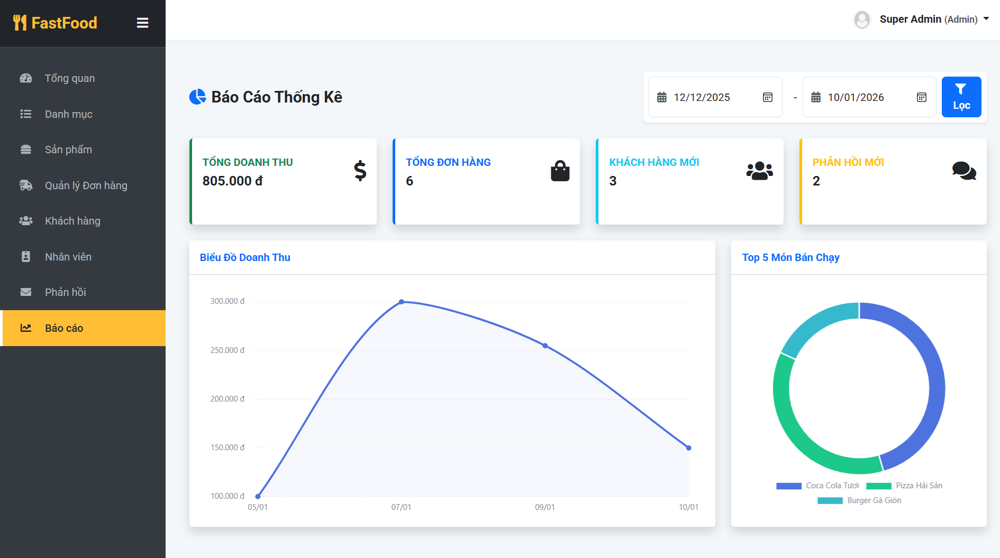

# 🍔 FastFood - Quick Service Restaurant Management System

**FastFood** is a web-based e-commerce solution designed to digitize the traditional food ordering process. Developed as a final term project for the **Web 1** course, this system connects customers with the restaurant while providing a comprehensive dashboard for managers to handle staff, inventory, and the entire order fulfillment lifecycle.

---

## 📖 About the Project

In the rapidly developing digital age, the demand for online food ordering has skyrocketed. **FastFood** was built to meet this need by providing a seamless e-commerce platform.

The system serves two main purposes:

1. **For Customers:** An easy-to-use interface to search for food, place orders, and track delivery status.
2. **For Managers:** A robust toolset to manage human resources, goods, and the operation process from order approval to final delivery.

### 🎯 Objectives

* **E-commerce System:** Enable customers to view menus, order, and pay (COD/QR) via the web.
* **Digital Operations:** Professionalize the workflow with specific roles for staff (Shippers/Approvers).
* **Data Management:** Centralized storage for products, categories, customers, feedback, and transaction history.
* **UX Optimization:** A fast, responsive UI built with **Bootstrap 5**, featuring automatic invoicing and status notifications.

---

## 📸 Project Demo

<div style="display: flex; gap: 10px;">
  
</div>






### Home Page & Menu







### Ordering Process & Cart







### Admin Dashboard & Order Management




*See more in the Images/ScreenShot folder.*
---


## 🚀 Key Features

### 👤 Customer Module

* **Authentication:** Secure Registration and Login functionality.
* **E-commerce Features:**
* Advanced product search.
* Shopping cart management.
* Checkout process with COD or QR payment options.


* **Order Tracking:** Monitor order status in real-time (Pending -> Approved -> Shipping -> Delivered).
* **Interaction:** Submit feedback on service quality.

### 🛠 Admin & Operations Module

* **Master Data Management:** Full CRUD (Create, Read, Update, Delete) for Categories, Products (Foods), Customers, and Staff.
* **Order Workflow:** A closed-loop process system:
1. Receive Order
2. Approve Order
3. Assign to Shipper
4. Complete/Cancel


* **Reporting:** Statistical dashboard for Revenue and Best-selling items to support decision-making.
* **Invoicing:** Automatic invoice generation.

---

## 💻 Tech Stack

This project is built on the **.NET** platform using the **Model-View-Controller (MVC)** architecture.

| Category | Technology |
| --- | --- |
| **Framework** | **ASP.NET MVC 5** (Separation of concerns: Logic, UI, Data) |
| **Language** | C# (Backend), JavaScript (Frontend) |
| **Database** | Microsoft SQL Server |
| **ORM** | Entity Framework (Code First / DB First) |
| **Frontend** | HTML5, CSS3, **Bootstrap 5** (Responsive Design) |
| **Libraries** | **SweetAlert2** (UI Notifications), **FontAwesome** (Icons) |
| **IDE** | Visual Studio |

---

## ⚠️ System Scope & Limitations

As this is an academic project, certain features are simulated or limited:

1. **Online Payment:** The QR Code payment feature is a simulation and is not integrated with a real banking payment gateway API.
2. **Logistics:** The system does not yet integrate real-time maps (e.g., Google Maps API) for calculating shipping fees based on distance or tracking shipper location.
3. **Security:** Password encryption and security measures are implemented at a basic level appropriate for a school project.

---

## ⚙️ Installation

To run this project locally:

1. **Clone the repository:**
```bash
git clone https://github.com/JulianNguyen05/FastFood

```


2. **Open in Visual Studio:**
Open the `.sln` file.
3. **Database Configuration:**
* Open `Web.config`.
* Update the `connectionStrings` to match your local SQL Server instance.


4. **Restore Packages:**
* Right-click the solution -> **Restore NuGet Packages**.


5. **Run the Application:**
* Press `F5` or click "IIS Express" to start the project.


---

**Author:** [Julian / Nguyen Huu Trong]
**Course:** Web 1 Application Development