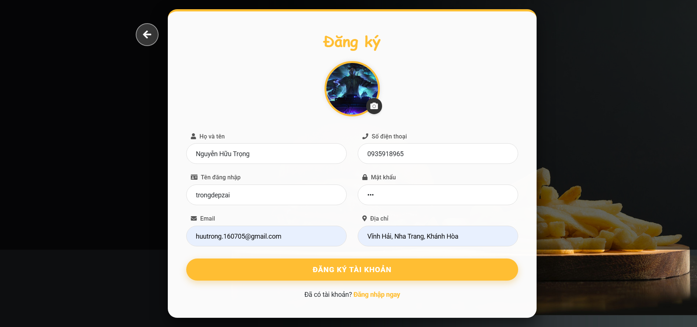
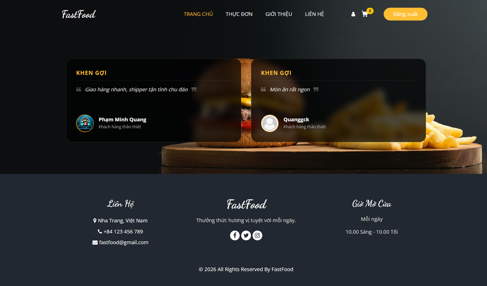
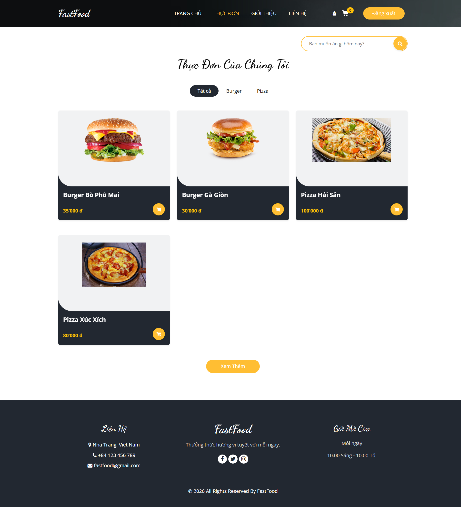
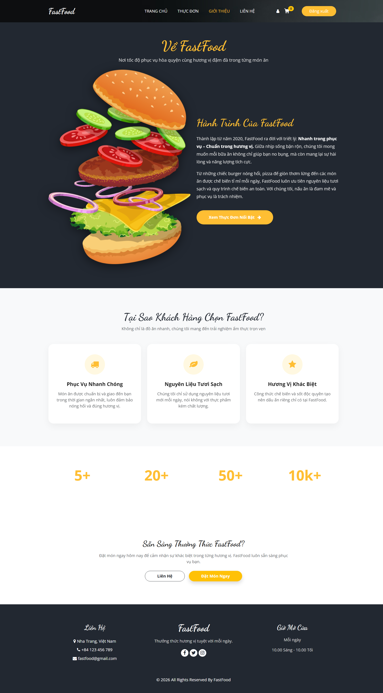
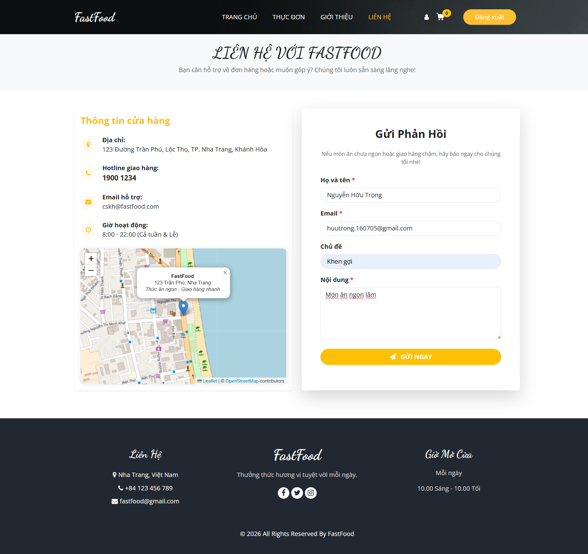
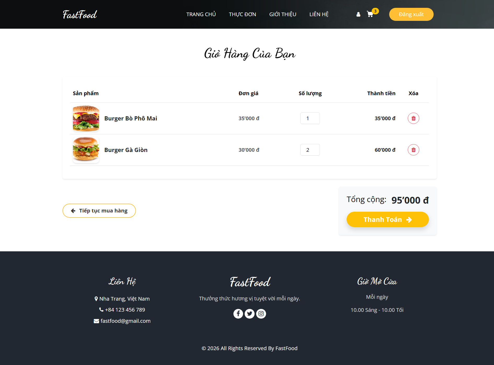
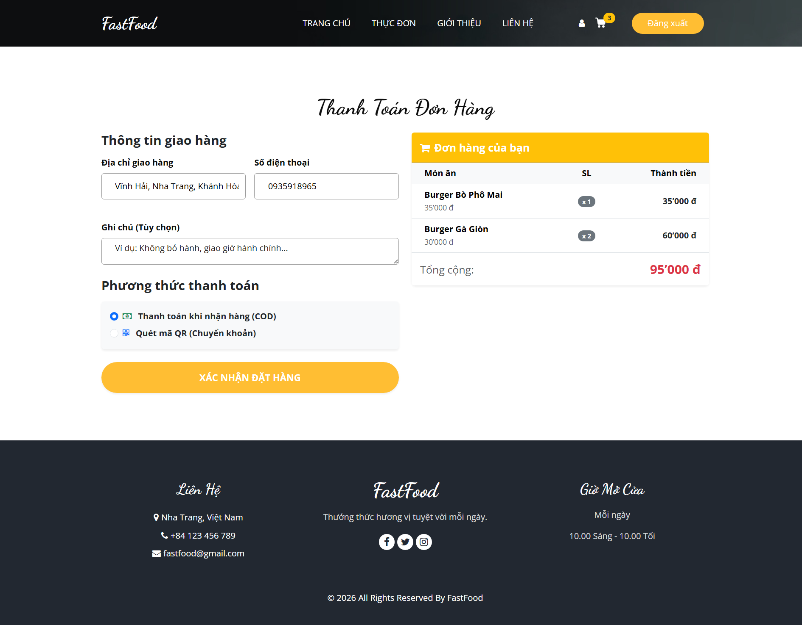
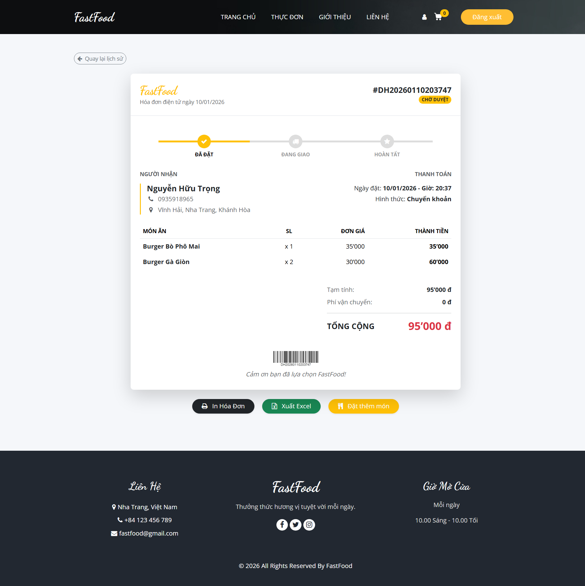
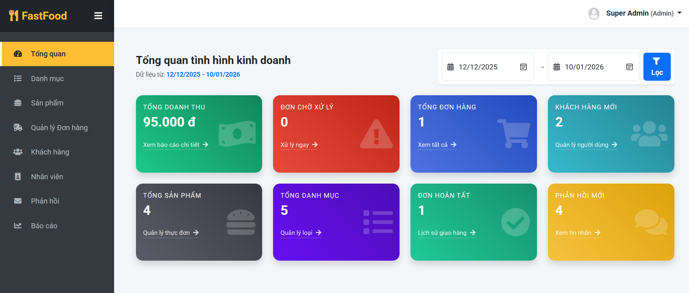
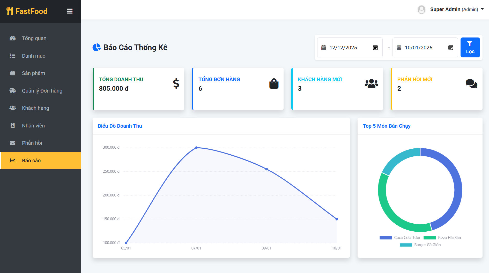

<div align="center">

# 🍔 FastFood — Hệ Thống Quản Lý Nhà Hàng Thức Ăn Nhanh

[](#)

---

<!-- TECH STACK BADGES -->


</div>

---

## 📖 Giới Thiệu Dự Án

**FastFood** là một hệ thống quản lý nhà hàng thức ăn nhanh dạng web, được xây dựng nhằm **số hóa toàn bộ quy trình đặt hàng và vận hành** từ khâu tiếp nhận đến giao hàng tận nơi. Dự án được phát triển trong khuôn khổ môn học **Web 1**, với mục tiêu tạo ra một giải pháp thương mại điện tử hoàn chỉnh cho ngành F&B.

Hệ thống phục vụ hai nhóm đối tượng chính:

- 🧑‍💻 **Khách Hàng** — Giao diện trực quan để tìm kiếm thực đơn, đặt hàng và theo dõi trạng thái giao hàng theo thời gian thực.
- 🛠️ **Quản Lý & Nhân Viên** — Bộ công cụ toàn diện để quản lý nhân sự, hàng hóa và toàn bộ vòng đời đơn hàng từ phê duyệt đến giao nhận.

### ✨ Điểm Nổi Bật

- 🔄 **Quy Trình Khép Kín** — Vòng đời đơn hàng được quản lý chặt chẽ: Tiếp nhận → Phê duyệt → Giao shipper → Hoàn thành / Hủy.
- 💳 **Đa Phương Thức Thanh Toán** — Hỗ trợ COD và thanh toán QR Code.
- 📊 **Báo Cáo Thống Kê** — Dashboard hiển thị doanh thu và các sản phẩm bán chạy, hỗ trợ ra quyết định.
- 🧾 **Tự Động Hóa** — Tự động sinh hóa đơn và thông báo trạng thái đơn hàng cho khách.
- 📱 **Giao Diện Responsive** — Tương thích trên mọi thiết bị nhờ Bootstrap 5.

---

## 📸 Giao Diện Hệ Thống

### 🔑 Xác Thực & Trang Chủ





### 🏠 Trang Chủ & Thực Đơn





### 🛒 Đặt Hàng & Giỏ Hàng





### 🛡️ Admin Dashboard & Quản Lý Đơn Hàng





> 📂 Xem thêm ảnh demo trong thư mục `Images/ScreenShot/`

---

## 🚀 Tính Năng Chi Tiết

### 👤 Module Khách Hàng

| Tính Năng | Mô Tả |
|---|---|
| **Đăng Ký / Đăng Nhập** | Xác thực tài khoản an toàn với validation đầy đủ phía client và server. |
| **Tìm Kiếm Sản Phẩm** | Tìm kiếm nâng cao theo tên, danh mục và bộ lọc giá. |
| **Giỏ Hàng** | Thêm, chỉnh sửa số lượng và xóa sản phẩm khỏi giỏ hàng theo thời gian thực. |
| **Thanh Toán** | Hỗ trợ 2 hình thức: COD (tiền mặt khi nhận hàng) và QR Code. |
| **Theo Dõi Đơn Hàng** | Xem trạng thái đơn hàng theo thời gian thực: Đang chờ → Đã duyệt → Đang giao → Đã giao. |
| **Phản Hồi** | Gửi đánh giá và phản hồi về chất lượng sản phẩm và dịch vụ. |

---

### 🛠️ Module Admin & Vận Hành

| Tính Năng | Mô Tả |
|---|---|
| **Quản Lý Danh Mục** | CRUD đầy đủ cho danh mục sản phẩm. |
| **Quản Lý Sản Phẩm** | Thêm, sửa, xóa và cập nhật thông tin món ăn (tên, giá, ảnh, mô tả). |
| **Quản Lý Khách Hàng** | Xem, tìm kiếm và quản lý tài khoản khách hàng. |
| **Quản Lý Nhân Viên** | Phân quyền rõ ràng cho nhân viên theo vai trò: **Người Duyệt Đơn** và **Shipper**. |
| **Quy Trình Đơn Hàng** | Vòng đời khép kín: Tiếp nhận → Phê duyệt → Giao Shipper → Hoàn thành / Hủy. |
| **Báo Cáo Thống Kê** | Dashboard doanh thu và sản phẩm bán chạy để hỗ trợ ra quyết định kinh doanh. |
| **Xuất Hóa Đơn** | Tự động sinh hóa đơn điện tử sau khi đơn hàng được xác nhận. |

---

## 💻 Công Nghệ Sử Dụng

Dự án được xây dựng trên nền tảng **.NET** theo kiến trúc **Model-View-Controller (MVC)**, đảm bảo sự tách biệt rõ ràng giữa logic nghiệp vụ, giao diện và dữ liệu.

| Hạng Mục | Công Nghệ |
|---|---|
| **Framework** | ASP.NET MVC 5 |
| **Ngôn Ngữ** | C# (Backend), JavaScript (Frontend) |
| **Cơ Sở Dữ Liệu** | Microsoft SQL Server |
| **ORM** | Entity Framework (Code First / DB First) |
| **Frontend** | HTML5, CSS3, Bootstrap 5 (Responsive Design) |
| **Thư Viện UI** | SweetAlert2 (Thông Báo), FontAwesome (Icons) |
| **IDE** | Visual Studio |

---

## 🏛️ Kiến Trúc Hệ Thống

Dự án tuân theo kiến trúc **MVC (Model-View-Controller)** chuẩn của ASP.NET, phân tách rõ ràng trách nhiệm của từng thành phần:

```
┌──────────────────────────────────────────────────────────┐
│                    CLIENT (Trình Duyệt)                  │
│            (Khách hàng, Nhân viên, Admin)                │
└────────────────────────┬─────────────────────────────────┘
                         │  HTTP Request
┌────────────────────────▼─────────────────────────────────┐
│                  🎮  CONTROLLER LAYER                    │
│    (Tiếp nhận request, điều hướng luồng xử lý)           │
│    AccountController, OrderController, AdminController   │
└───────────┬────────────────────────────┬─────────────────┘
            │                            │
┌───────────▼──────────┐    ┌────────────▼─────────────────┐
│    🔷  MODEL LAYER   │    │       🖥️  VIEW LAYER          │
│  (Entity Framework,  │    │  (Razor Views, Bootstrap 5,  │
│  SQL Server, LINQ    │    │   JavaScript, SweetAlert2)   │
│  Queries, Business   │    │   Giao diện khách hàng &     │
│  Logic)              │    │   Dashboard quản lý)         │
└──────────────────────┘    └──────────────────────────────┘
```

### 🔷 Model — Dữ Liệu & Nghiệp Vụ

Tầng Model sử dụng **Entity Framework** để ánh xạ trực tiếp với cơ sở dữ liệu SQL Server. Các Entity chính bao gồm:

- `NguoiDung` — Quản lý tài khoản (khách hàng, nhân viên, admin).
- `SanPham` / `DanhMuc` — Quản lý thực đơn và phân loại.
- `DonHang` / `ChiTietDonHang` — Vòng đời đơn hàng và chi tiết từng món.
- `HoaDon` — Tự động sinh sau khi đơn hoàn thành.
- `PhanHoi` — Lưu trữ đánh giá và góp ý của khách hàng.

### 🖥️ View — Giao Diện Người Dùng

Giao diện được xây dựng bằng **Razor Views** kết hợp **Bootstrap 5**, tách biệt thành 2 khu vực:

- **Khu vực khách hàng** — Trang chủ, thực đơn, giỏ hàng, thanh toán, theo dõi đơn hàng.
- **Khu vực quản lý** — Dashboard admin, quản lý nhân sự, sản phẩm, đơn hàng và báo cáo.

### 🎮 Controller — Điều Phối Luồng Xử Lý

Các controller tiếp nhận HTTP request, gọi Model xử lý nghiệp vụ và trả về View tương ứng, phân quyền rõ ràng theo vai trò người dùng.

---

## ⚠️ Phạm Vi & Giới Hạn

Đây là dự án học thuật nên một số tính năng được mô phỏng hoặc giới hạn:

| Giới Hạn | Chi Tiết |
|---|---|
| **Thanh Toán Online** | Tính năng QR Code là mô phỏng, chưa tích hợp với cổng thanh toán ngân hàng thực tế. |
| **Logistics** | Chưa tích hợp bản đồ thời gian thực (Google Maps API) để tính phí ship và theo dõi vị trí shipper. |
| **Bảo Mật** | Mã hóa mật khẩu và các biện pháp bảo mật ở mức cơ bản, phù hợp với phạm vi học thuật. |

---

## ⚙️ Hướng Dẫn Cài Đặt

### 📋 Yêu Cầu Môi Trường

| Công Nghệ | Phiên Bản |
|---|---|
| Visual Studio | 2019 / 2022 |
| .NET Framework | 4.7.2+ |
| SQL Server | 2019+ |
| SQL Server Management Studio | (Khuyến nghị) |

---

### Bước 1 — Clone Repository

```bash
git clone https://github.com/JulianNguyen05/FastFood
```

---

### Bước 2 — Mở Dự Án

Mở file `.sln` bằng **Visual Studio**.

---

### Bước 3 — Cấu Hình Cơ Sở Dữ Liệu

Mở file `Web.config` và cập nhật connection string:

```xml
<connectionStrings>
  <add name="FastFoodContext"
       connectionString="Data Source=YOUR_SERVER_NAME;
                         Initial Catalog=FastFoodDB;
                         Integrated Security=True;"
       providerName="System.Data.SqlClient" />
</connectionStrings>
```

> 💡 Thay `YOUR_SERVER_NAME` bằng tên SQL Server instance trên máy bạn (thường là `localhost` hoặc `.\SQLEXPRESS`).

---

### Bước 4 — Restore NuGet Packages

Trong Visual Studio: **Chuột phải vào Solution** → **Restore NuGet Packages**.

---

### Bước 5 — Khởi Chạy Ứng Dụng

Nhấn **F5** hoặc click **IIS Express** để build và chạy dự án.

✅ Ứng dụng sẽ khởi động tại `https://localhost:44341`

---

## 📁 Cấu Trúc Thư Mục

```
FastFood/
├── 📁 Controllers/          # Điều hướng request theo vai trò
│   ├── AccountController.cs #   → Đăng ký, đăng nhập, xác thực
│   ├── OrderController.cs   #   → Quy trình đặt hàng, thanh toán
│   └── AdminController.cs   #   → Dashboard và quản lý hệ thống
│
├── 📁 Models/               # Entity Framework & Business Logic
│   ├── Entities/            #   → NguoiDung, SanPham, DonHang...
│   └── ViewModels/          #   → Dữ liệu truyền vào View
│
├── 📁 Views/                # Razor Views (Giao diện người dùng)
│   ├── Home/                #   → Trang chủ, thực đơn, liên hệ
│   ├── Order/               #   → Giỏ hàng, checkout, hóa đơn
│   └── Admin/               #   → Dashboard, quản lý, báo cáo
│
├── 📁 Content/              # CSS, font, static assets
├── 📁 Scripts/              # JavaScript files
├── 📁 Images/               # Ảnh sản phẩm & screenshots
│   └── 📁 ScreenShot/       #   → Demo screenshots
└── Web.config               # Cấu hình ứng dụng & kết nối DB
```

---

<div align="center">

**Được xây dựng bởi Julian Nguyen (Nguyễn Hữu Trọng)**

[](https://github.com/JulianNguyen05/FastFood)

</div>
